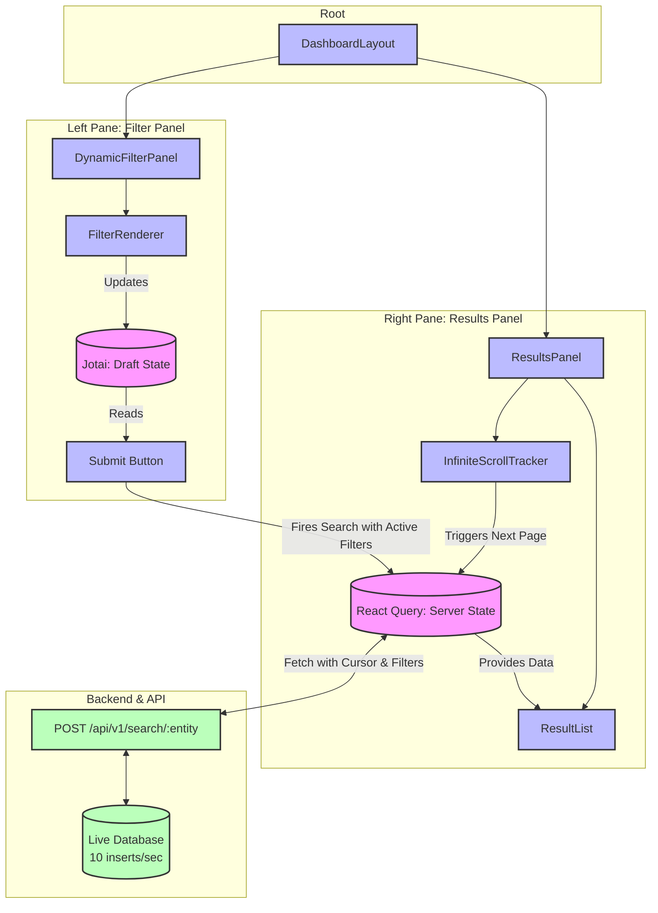

# Component Hierarchy & Responsibilities

To make this dashboard work for _Orders_, _Customers_, or _Products_, we use a **Config-Driven UI Pattern**. Instead of hardcoding components, the parent passes a configuration object to the children.

### 1. Root: `<DashboardLayout />`

- **Role:** The root component. It holds the layout structure (Sidebar vs. Main Content) but knows nothing about business logic.

### 2. Left Pane: `<DynamicFilterPanel />`

- **Role:** Renders the filters based on a JSON config. It holds the "Draft State" (what the user is typing/selecting _before_ they hit submit).
- **Children:**
  - `<FilterRenderer />`: A switch statement/factory that renders the correct input type.
    - `<TextInput />` (e.g., Order ID)
    - `<DateRangePicker />` (e.g., Start/End Time)
    - `<DropdownSelect />` (e.g., Status)
  - `<SubmitButton />`: Pushes the "Draft State" to the "Active Search State".

### 3. Right Pane: `<ResultsPanel />`

- **Role:** Displays the data and handles scrolling.
- **Children:**
  - `<InfiniteScrollTracker />`: An invisible `div` at the bottom of the list using the `IntersectionObserver` API to detect when to fetch more data.
  - `<ResultList />`: Maps over the data.
  - `<GenericCard />`: The UI for a single row/item.
